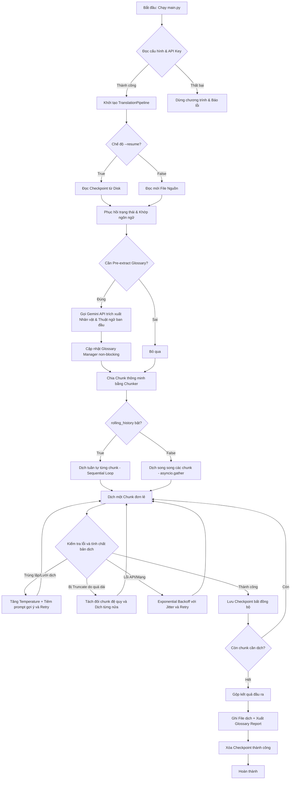

# 📚 Novel Translator Pipeline (v2) - System Documentation & Architecture

Tài liệu này mô tả chi tiết kiến trúc hệ thống, luồng xử lý (tool flow), thiết kế mã nguồn và các tính năng nâng cao đã được tích hợp trong phiên bản **v2** của hệ thống dịch truyện bằng LLM.

---

## 1. Luồng xử lý dữ liệu (Tool Flow)

Hệ thống hoạt động theo mô hình bất đồng bộ (Asynchronous Event-driven Pipeline) với luồng dữ liệu đi qua các bước được biểu diễn qua sơ đồ sau:



### Luồng chi tiết:
1.  **Khởi tạo & Phát hiện ngôn ngữ**: Nhận diện ngôn ngữ nguồn (Tiếng Trung, Anh, Nhật, Hàn) bằng thuật toán heuristic và lấy cấu hình tương ứng trong `genres.yaml`.
2.  **Trích xuất ban đầu (Pre-extraction)**: Gửi 15.000 ký tự đầu tiên lên Gemini API để xây dựng tệp nhân vật (Character) và thuật ngữ (Glossary) ban đầu, đồng bộ hóa xuống đĩa dạng JSON.
3.  **Chia nhỏ văn bản (Smart Chunking)**: Phân tách tệp truyện thành các đoạn nhỏ (mặc định 2500 tokens) dựa trên ranh giới đoạn văn hoặc câu để tránh làm rách mạch truyện.
4.  **Dịch hội thoại nhiều lượt (Rolling History)**:
    *   *Chế độ tuần tự*: Dịch lần lượt từng chunk, tích lũy lịch sử `N` chunk gần nhất dưới dạng hội thoại `user/model` đan xen giúp model học cách hành văn của các đoạn trước.
    *   *Chế độ song song*: Chạy song song tất cả các chunk để tối đa hóa tốc độ, kiểm soát bằng một `asyncio.Semaphore` toàn cục để tránh lỗi giới hạn tần suất (Rate Limit).
5.  **Hậu xử lý & Lưu trữ**: Xuất văn bản dịch hoàn chỉnh ra thư mục `output/` kèm theo một báo cáo thuật ngữ định dạng Markdown (`*_glossary_report.md`).

---

## 2. Giải thích chi tiết các Module mã nguồn (Codebase)

### 2.1. `main.py` (CLI Entry Point)
*   **Chức năng**: Quản lý giao diện dòng lệnh (Command Line Interface).
*   **Nhiệm vụ chính**:
    *   Phân tích cú pháp các tham số đầu vào (`--project`, `--genre`, `--input`, `--workers`, `--resume`, `--status`...).
    *   Nạp biến môi trường từ file `.env` bằng `dotenv`.
    *   Khởi chạy pipeline bất đồng bộ bằng `asyncio.run(main())`.

### 2.2. `src/chunker.py` (Bộ chia tách ngữ nghĩa)
*   **Chức năng**: Chia văn bản gốc thành các chunk có kích thước đồng đều và bảo toàn ngữ cảnh.
*   **Cơ chế**:
    *   Tính toán độ dài token ước lượng cho từng đoạn văn (`estimate_tokens`).
    *   Nếu một đoạn văn quá dài, hệ thống sẽ cố gắng tìm điểm ngắt tại dấu kết thúc câu (`.`, `!`, `?`, `。`, `！`, `？`, `…`) thay vì cắt ngẫu nhiên giữa chừng.
    *   Hỗ trợ phát hiện Script ngôn ngữ (Latin vs. CJK) để áp dụng hệ số đếm chữ trên token (`chars_per_token`) phù hợp (tiếng Trung/Hàn/Nhật chiếm nhiều token hơn trên cùng một số lượng ký tự so với tiếng Anh).

### 2.3. `src/glossary_manager.py` (Quản lý thuật ngữ luồng an toàn)
*   **Chức năng**: Lưu trữ, tra cứu và cập nhật động các nhân vật cùng từ khóa đặc thù.
*   **Đặc điểm nâng cao**:
    *   **Thread-safety**: Sử dụng `threading.Lock()` để bảo vệ bộ dữ liệu glossary dùng chung, ngăn chặn lỗi ghi đè dữ liệu khi nhiều tác vụ song song cùng cập nhật thuật ngữ mới.
    *   **Read-Modify-Write**: Mỗi khi thêm từ, Glossary Manager sẽ đọc lại nội dung mới nhất từ đĩa, thực hiện trộn dữ liệu (merge) trong memory và lưu xuống đĩa atomically qua file tạm (`.tmp`).
    *   **Trộn nhân vật theo trường**: Hỗ trợ bóc tách thông tin nhân vật dạng `tên dịch | vai trò | xưng hô`. Khi phát hiện trùng tên, hệ thống tự động gộp các vai trò mới và tích hợp xưng hô dạng `cũ / mới` (ví dụ: `cô / tôi`).
    *   **Relevance Filtering (Lọc liên quan)**: Khi lấy glossary cho một chunk, hệ thống so khớp substring case-insensitive để chỉ lấy các từ thực sự xuất hiện trong chunk đó, tiết kiệm đáng kể token đầu vào cho prompt.

### 2.4. `src/checkpoint_manager.py` (Quản lý điểm dừng)
*   **Chức năng**: Lưu trữ tiến trình dịch để có thể khôi phục trong trường hợp mất kết nối mạng hoặc lỗi API.
*   **Cơ chế**: Lưu tiến trình dịch của từng file thành một tệp JSON trong thư mục `checkpoints/`. Khi người dùng chạy lệnh dịch kèm flag `--resume`, hệ thống sẽ đọc lại tệp JSON này và chỉ biên dịch các chunk bị lỗi hoặc chưa hoàn thành.

### 2.5. `src/pipeline.py` (Trái tim điều phối hệ thống)
*   **Chức năng**: Điều phối luồng làm việc chính, giao tiếp API và xử lý lỗi dịch thuật.
*   **Các hàm quan trọng**:
    *   `translate_file`: Quản lý toàn bộ vòng đời dịch một file, nạp/lưu checkpoint, chạy pre-extraction, chia chunk và thực hiện gom kết quả dịch.
    *   `_translate_chunk_with_retry`: Wrapper thực hiện cơ chế thử lại (retry) thông minh, bắt các lỗi định dạng, lỗi lười dịch, lỗi trùng lặp và lỗi phân mảnh.
    *   `_build_multi_turn_contents`: Xây dựng cấu trúc hội thoại nhiều lượt từ các chunk đã dịch trước đó để làm rolling history.
    *   `_call_genai`: Tác vụ tương tác trực tiếp với SDK Gemini hỗ trợ cả hai mô hình gọi bất đồng bộ native và bọc executor.

---

## 3. Chi tiết các tính năng cao cấp (v2 Improvements)

Hệ thống được thiết kế theo chuẩn Senior Software Architecture với các cơ chế tự chữa lành và tối ưu hóa tài nguyên như sau:

### 3.1. Loại bỏ lỗi concurrency nhân đôi (Double Concurrency Bug)
*   *Vấn đề cũ*: Cả tầng xử lý file và tầng xử lý chunk đều sử dụng cấu hình workers riêng, dẫn đến số lượng request thực tế bằng tích của chúng ($workers \times workers$), gây nghẽn hàng đợi hoặc vượt giới hạn API.
*   *Giải pháp v2*: Triển khai một `asyncio.Semaphore` toàn cục duy nhất (`max_concurrent_requests`) bảo vệ tất cả các lượt gọi API trong `_run_api_task`. Cơ chế semaphore cục bộ mức workers chỉ kích hoạt khi tắt semaphore toàn cục.

### 3.2. Chống lười dịch & Trùng lặp (TF-IDF + Cosine Similarity)
*   *Cơ chế*: Tính toán độ tương đồng cosine dựa trên tần suất từ được chuẩn hóa TF-IDF giữa bản dịch và văn bản gốc (phát hiện lười dịch) hoặc với bản dịch của 2 chunk liền trước (phát hiện trùng lặp/lặp từ vô nghĩa).
*   *Tự phục hồi*: Nếu similarity vượt quá ngưỡng cho phép (mặc định $0.75$ cho lười dịch và $0.85$ cho trùng lặp):
    *   Hệ thống hủy kết quả lỗi và tăng lượt retry.
    *   Tăng dần độ sáng tạo của LLM ở các lượt thử lại: $temp = \min(1.0, base\_temp + 0.15 \times retry)$.
    *   Tiêm thêm chỉ thị cảnh báo khẩn cấp (ví dụ: *"Bản dịch vừa rồi quá giống bản gốc, yêu cầu dịch dịch sang tiếng Việt hoàn chỉnh"*) vào System Prompt.

### 3.3. Tự động chia nhỏ đệ quy khi gặp lỗi Truncation
*   Khi Gemini API trả về kết quả bị cắt cụt do chạm giới hạn token (`finish_reason == 'MAX_TOKENS'`), hệ thống ném ra `TruncatedResponseError`.
*   Pipeline tự động chia đôi chunk hiện tại theo ranh giới đoạn văn (hoặc dấu câu) và gọi dịch đệ quy cho từng nửa nhỏ, sau đó ghép lại liền mạch. Độ sâu đệ quy mặc định là 3 cấp.

### 3.4. Gỡ bỏ kiểm duyệt và giữ nguyên gốc truyện (Uncensored Mode)
*   Tất cả các lệnh gọi API đều được chèn cấu hình `safety_settings` ở mức **`BLOCK_NONE`** cho cả 4 nhóm an toàn của Google:
    ```python
    types.SafetySetting(
        category=types.HarmCategory.HARM_CATEGORY_SEXUALLY_EXPLICIT,
        threshold=types.HarmBlockThreshold.BLOCK_NONE,
    )
    ```
*   Điều này giúp dịch hoàn hảo các tác phẩm tiên hiệp, hành động kỳ ảo hoặc lãng mạn có yếu tố bạo lực hư cấu hoặc nội dung người lớn (NSFW) mà không bị lỗi `500 INTERNAL` hoặc từ chối dịch.

### 3.5. Rolling History & Token Budgeting
*   Khi dịch một chunk, hệ thống truyền tệp lịch sử gồm cặp nguồn/dịch của $N$ chunk trước dưới dạng đa lượt (multi-turn chat representation).
*   Để tránh tràn ngữ cảnh và tốn phí token, hệ thống tính toán tổng dung lượng của `[System Prompt + Glossary + History + Current Chunk]`. Nếu vượt quá `history_token_budget` cấu hình (mặc định 4000 tokens), hệ thống sẽ tự động loại bỏ các cặp lịch sử cũ nhất (FIFO) cho đến khi nằm trong ngưỡng an toàn.

### 3.6. Không chặn vòng lặp chính (Non-blocking I/O)
*   Mọi thao tác ghi/đọc file đĩa (lưu checkpoint, ghi output dịch, load tệp nguồn, ghi đè glossary) đều được offload sang Thread Pool thông qua `run_in_executor` để đảm bảo event loop chính của ứng dụng chạy bất đồng bộ mượt mà 100%, không bị nghẽn (blocking) bởi tốc độ của đĩa cứng.

---

## 4. Đặc tả kỹ thuật Cấu hình (Config Specs)

Tất cả các hành vi của hệ thống đều có thể được bật/tắt động trong [settings.yaml](file:///D:/LT/LLM%20Trans/v2/config/settings.yaml):

```yaml
features:
  auto_glossary: true                  # Tự động trích xuất thuật ngữ lúc đầu
  auto_summary: true                   # Kích hoạt tóm tắt ngữ cảnh
  clean_thinking_tags: true            # Xóa các thẻ nháp <think> của model
  relevance_filtering: true            # Bật lọc glossary khớp với nội dung chunk
  inject_glossary_in_system_prompt: true # Tiêm glossary vào System Prompt
  rolling_history: true                # Dịch tuần tự mang theo lịch sử đa lượt
  use_async_client: true               # Dùng client aio bất đồng bộ native
  detect_duplicate_translation: true   # Bật tính toán cosine similarity để chống trùng lặp/lười
```
